# CLAUDE.md — Build Brief: Skinstinct Content Engine (Telegram → Gemini → Review Gate)

> **For Claude Code.** This is the complete brief for the application. Read it end to end before writing any code. Then read `prompts/voice_skills.txt` in full, because it is the voice contract every draft must satisfy. Produce a plan that follows the milestones in Section 9, confirm it with the user, and then build one milestone at a time. Run the tests after each milestone.

---

## 0. Setup the user must complete before you start

Ask the user to confirm each item. Do not proceed to Milestone 2 until items 1 to 4 are confirmed.

1. **Secrets live in `.env` only.** Create `.env.example` (committed) and `.env` (git-ignored). Ask the user to paste the real values into `.env` themselves. **Never write secrets into source code, tests, logs, commit messages, or this file.** Never print them to the console. Mask them in any error output (`8957…LEB4`).
2. **The bot is an admin of the notes channel.** The notes chat ID is `-1003976391640`. The `-100` prefix means it is a channel or supergroup. A bot only receives `channel_post` updates from a channel where it is an administrator. It needs "Post messages" permission, and "Add reactions" is optional.
3. **Meera has opened a private chat with the bot and sent `/start`.** The bot replies with her numeric Telegram user ID. The user puts that ID in `.env` as `MEERA_USER_ID`. The review gate runs in this private chat, not in the notes channel (see 5.6 for why).
4. **Historical data is placed in the repo:**
   - `data/notes/`: the 60 raw fragments (`.txt`, `.md`, or a single export file).
   - `data/published/`: the 15 published pieces (4 LinkedIn posts, 11 newsletters). These are voice exemplars.
   - `prompts/voice_skills.txt`: Meera's voice skill file.

   The Telegram Bot API cannot read channel history from before the bot joined, and `getUpdates` only holds about 24 hours of updates. The backlog must therefore be imported from files, not from Telegram.
5. **The Gemini key format is valid.** New Google AI Studio keys start with `AQ.`, not `AIza`. Do **not** regex-validate the key format anywhere. Validate it with a live health check at startup (Section 6.1). Use the official `google-genai` Python SDK at its latest version. If that SDK rejects the key, report the exact error to the user. Do not try workarounds that change how the key is sent without asking first.

`.env.example`:
```
TELEGRAM_BOT_TOKEN=
TELEGRAM_NOTES_CHAT_ID=-1003976391640
MEERA_USER_ID=
REVIEW_CHAT_ID=            # defaults to MEERA_USER_ID (private chat with the bot)
GEMINI_API_KEY=
GEMINI_MODEL=gemini-3.7-flash
GEMINI_FALLBACK_MODELS=gemini-3.6-flash,gemini-3.1-flash-lite
TIMEZONE=Asia/Kolkata
TRIAGE_SCHEDULE=MON,WED,FRI@08:00
SHORTLIST_SIZE=4
NEWS_LOOKBACK_DAYS=14
AUTO_DRAFT_TOP_N=0         # 0 = Meera picks every note (Judgment Protected). Do not change without her say-so.
ALLOW_HASHTAGS=false
DB_PATH=data/app.db
LOG_LEVEL=INFO
```

---

## 1. The Automation Brief: Why

### Pain
Meera has not posted on LinkedIn in 11 weeks. She captures ideas constantly: 2 to 3 Telegram notes a week, about 60 fragments over 8 months. **None of them became posts.** She has 40 abandoned drafts in Google Drive, most stopped within two paragraphs. The posts that did ship took 90 to 180 minutes each. She describes that time as stall time, not writing time: *"I open the doc, I write two lines, I decide it's not good enough, I close it."* A content writer she hired produced clean, accurate posts, but they took her longer to rewrite than writing from scratch would have. She stopped after four posts.

The silence has a cost. Her last post, a seven-paragraph breakdown of niacinamide concentration, drove 340 profile visits in 48 hours and 3 wholesale enquiries. Her four posts together earned 47,000 impressions for an account with 6,200 followers. Her buyers (urban women aged 28 to 40 who are tired of being sold to) respond to founders who know their science. Every silent week is lost reach with exactly those buyers.

### User
**Meera Pillai, and only Meera.** She is the founder of Skinstinct, a D2C skincare brand earning ₹14–16 lakh a month, launched 18 months ago in Mumbai. She has a pharma formulation background. She works from her phone and already captures into Telegram, and **she is not changing that habit.** She is the sole capturer, sole reviewer, and sole publisher. There is no team and no writer.

### Outcome (measurable)
| Metric | Today | Target |
|---|---|---|
| LinkedIn posts published per week | 0 (11 weeks silent) | **3** |
| Meera's time per published post | 90–180 min | **≤ 15 min** (review and light edit) |
| Captured notes that reach a draft | 0 of 60 | ≥ 1 in 3 of new notes shortlisted |
| Drafts approved with light or no edits | n/a (writer: rewrite > scratch) | **≥ 60%** |
| Drafts that fail the voice QA hard-fail list when delivered | n/a | **0** |
| Posts published without Meera's approval | n/a | **0, by design** |

### Journey Today
1. A thought occurs at the manufacturing unit, in a customer DM, or while reading at 11pm.
2. Meera drops a text or voice note into her private Telegram channel.
3. The note sits there. Nothing reviews, ranks, or revisits it.
4. Occasionally she decides to write. She opens a Google Doc from scratch.
5. She writes two lines, judges them not good enough, and closes the doc.
6. Two weeks later she comes back. The moment has passed, and the draft joins the 40 abandoned ones.
7. Rarely, she pushes through: 90 to 180 minutes, mostly stall time.
8. She posts manually on LinkedIn. It performs well. The cycle does not repeat, and she has been silent for 11 weeks.

### Journey After (what you are building)
1. Meera drops notes into Telegram exactly as she does now. She changes nothing.
2. The bot silently captures each note and transcribes voice notes.
3. Three mornings a week, the bot sends her a shortlist of the strongest 3 to 5 notes, with a one-line reason for each.
4. She taps **Draft this** on one.
5. The bot finds a current news angle from Google News RSS (or reports that none fits), drafts a post in her voice, lints it against her voice rules, and sends it with the source link and any `[VERIFY]` flags.
6. She taps **Approve**, **Revise** (with a typed instruction), **Regenerate**, **Change angle**, or **Reject**.
7. After she approves, the bot sends a clean, copy-ready version. **She pastes it into LinkedIn herself.**
8. The bot logs everything for weekly stats.

---

## 2. The Nine Checks

| # | Check | Evidence from the case | Result |
|---|---|---|---|
| **Kill switches** | | | |
| 01 | Problem Real | 11 weeks silent. 60 captured notes → 0 posts. 40 abandoned drafts. 90–180 min stall per post. A paid writer failed. | **Pass** |
| 02 | Workflow Repeated | Capture happens 2–3 times a week and is ongoing. The target is 3 posts every week. | **Pass** |
| 03 | Input Available | Live notes arrive in Telegram. 60 historical notes are in `notes/`. 15 voice references are in `published/`. The voice skill is built. Google News RSS is public. *Caveat: the bot can't read Telegram history, so the backlog is imported from files.* | **Pass** |
| **Sizing** | | | |
| 04 | Output Valuable | One post → 340 profile visits in 48h and 3 wholesale enquiries. 47k impressions from 4 posts. | **Pass** |
| 05 | Impact Measurable | Posts per week, minutes per post, approval rate, edit ratio, and note-to-post conversion are all logged by the app. | **Pass** |
| 08 | ROI Worth It | Build effort is days. Running cost is a Flash-tier model plus free Telegram and RSS, so it should be small per draft (the app logs actual cost). One wholesale enquiry outweighs months of running cost for a ₹14–16L/month business. | **Pass** |
| **Boundary** | | | |
| 06 | Failure Risk OK | Her brand *is* scientific accuracy. A wrong pH value, an invented statistic, a misread news item, or a hype phrase would damage the one asset that converts. The writer failed on voice, not on grammar. **The consequence of error is high.** | **Fail for autonomy → human stays** |
| 07 | Judgment Protected | Meera chooses which note to develop and approves every post. Nothing reaches LinkedIn except by her hand. | **Pass (by design)** |
| 09 | Owner Clear | Meera owns every published word. The bot owns nothing public. | **Pass** |

### The Cut
**Check 06 (Failure Risk), enforced through Check 07 (Judgment Protected), removes two things Meera described wanting:**

1. **Autonomous "figure out which ones are worth developing" and end-to-end publishing.** The AI ranks and recommends, and Meera picks. The AI drafts, and Meera approves and posts herself. **Do not build LinkedIn API posting. Do not auto-select notes** (`AUTO_DRAFT_TOP_N=0`). She has already passed on two consultants' end-to-end tools, which confirms this boundary.
2. **An AI-supplied "industry data point."** The model may **only** reference news items actually retrieved from Google News RSS, shown to Meera with their URL. It may never generate statistics, studies, or "industry data" from its own knowledge. Missing evidence becomes `[SOURCE NEEDED: …]` for Meera to fill.

"Three posts a week without it consuming her time" becomes "three posts a week in 15 minutes each." The time does not go to zero, because the review gate is the product.

---

## 3. Components Map (Trigger → Input → Context → Processing → AI → Output)

A sixth actor row, **Orchestrator**, has been added. The Python service you build needs its own row because it does the deterministic work that no listed actor does. ● marks a handoff. 🔒 marks the human gate.

| Actor | Trigger | Input | Context | Processing | AI | Output |
|---|---|---|---|---|---|---|
| **Meera** | Has a thought → drops note ● | Text or voice note | — | — | — | 🔒 Picks note from shortlist ●; approves / revises / rejects draft ●; pastes approved post into LinkedIn herself |
| **Telegram** | `channel_post` update ●; scheduled triage message; button callbacks ● | Message text, voice file ID, caption | — | Delivers shortlist and draft cards with inline buttons | — | Shortlist card ●, draft card ●, copy-ready final ● |
| **Orchestrator** (Python service) | Scheduler (Mon/Wed/Fri 08:00 IST), `/triage`, callbacks | Notes from SQLite; RSS items | Loads voice skill, fact bank, and category-matched exemplars ● | Stores notes; dedupes; builds prompts; filters RSS by date/relevance; **lints drafts deterministically**; retries on lint failure; logs metrics | — | Prompt packages to Gemini ●; cards to Telegram ● |
| **Gemini** | Called by the Orchestrator ● | Note(s), candidate news items | `voice_skills.txt`, `facts.yaml`, 2–3 exemplars | — | Transcribes voice; scores and clusters notes; writes news search queries; picks an angle or "none"; drafts the post; self-QA + evidence ledger (structured JSON) | Scores JSON ●; draft JSON ● |
| **Google News RSS** | Queried per selected note ● | Search queries (en-IN) | — | Returns title, source, link, pubDate, snippet | — | Candidate items ● |
| **Review Gate** 🔒 | Draft delivered ● | Draft + source link + flags + QA score | Meera's judgement | Buttons: Approve / Revise / Regenerate / Change angle / No news / Reject | — | Only an approved text is released ● (and logged) |

```mermaid
flowchart LR
  M1[Meera drops note] --> T1[Telegram channel_post]
  T1 --> O1[Orchestrator: store + transcribe via Gemini]
  S[Scheduler Mon/Wed/Fri] --> O2[Orchestrator: triage batch]
  O2 --> G1[Gemini: score + cluster]
  G1 --> T2[Telegram: shortlist card]
  T2 --> RG1{{Meera picks - HUMAN GATE}}
  RG1 --> O3[Orchestrator: news queries]
  O3 --> N[Google News RSS]
  N --> G2[Gemini: pick angle or none + draft]
  G2 --> L[Orchestrator: voice linter + retry]
  L --> T3[Telegram: draft card]
  T3 --> RG2{{Review Gate - HUMAN GATE}}
  RG2 -- Revise/Regenerate --> G2
  RG2 -- Approve --> F[Copy-ready final]
  F --> M2[Meera posts on LinkedIn manually]
```



---

## 4. Tech stack and constraints

- **Python 3.11+**, single deployable service, **long polling** (no public URL needed). Keep a webhook mode behind a flag for later.
- **`python-telegram-bot` v21+** (async, built-in `JobQueue` for scheduling).
- **`google-genai`** (official Google Gen AI SDK). Check the current SDK docs before coding, and use structured output with Pydantic response schemas.
- **`feedparser`** + `httpx` for Google News RSS.
- **SQLite** via the standard `sqlite3` module or SQLModel. Keep it simple; no external DB.
- **`pydantic-settings`** for config; **`tenacity`** for retries; **`pytest`** for tests.
- Timezone `Asia/Kolkata` for all scheduling and display.
- Run with `python -m app` locally. Include a `Dockerfile` and a short `DEPLOY.md` for a small VM or Railway/Render.
- No LinkedIn integration. No web dashboard in v1. Telegram is the entire UI.

### Suggested structure
```
skinstinct-content-engine/
├── CLAUDE.md                  # this file
├── .env.example  .gitignore  requirements.txt  Dockerfile  DEPLOY.md  README.md
├── prompts/
│   ├── voice_skills.txt       # provided — load verbatim, never edit programmatically
│   ├── triage.md              # scoring prompt
│   ├── news_queries.md        # query-generation prompt
│   ├── draft.md               # drafting prompt (wraps voice skill)
│   └── revise.md              # revision prompt
├── config/
│   ├── facts.yaml             # fact bank extracted from voice skill §14, with status flags
│   └── lint_rules.yaml        # banned words, spellings, limits (from voice skill §8, §17)
├── data/  notes/  published/  app.db
├── app/
│   ├── __main__.py            # entrypoint, startup health checks
│   ├── config.py
│   ├── db.py                  # schema + repository functions
│   ├── telegram_bot.py        # handlers, keyboards, auth guard
│   ├── capture.py             # channel_post → note; voice → transcript
│   ├── triage.py              # batch scoring, clustering, shortlist
│   ├── news.py                # Google News RSS fetch + filter
│   ├── drafting.py            # prompt assembly, Gemini call, retry-on-lint loop
│   ├── linter.py              # deterministic voice checks
│   ├── gemini_client.py       # model selection, fallback, retries, token/cost logging
│   ├── exemplars.py           # pick 2–3 published pieces by category
│   ├── metrics.py             # /stats
│   └── importer.py            # CLI: import data/notes and data/published
└── tests/
```

---

## 5. Functional specification

### 5.1 Capture (live)
- Handle `channel_post` **only** where `chat.id == TELEGRAM_NOTES_CHAT_ID`. Ignore every other chat.
- **Text:** store as-is. **Voice/audio:** download via `getFile` and send the audio to Gemini with a transcription instruction ("verbatim transcript; keep technical terms such as pH, INCI, CoA, niacinamide as spoken; no summarising"). Store both the transcript and the file ID. **Photo/document with caption:** store the caption and note that an attachment exists. **Forwarded messages/links:** store the text and URL.
- Also handle `edited_channel_post` by updating the stored note.
- Dedupe on `(chat_id, message_id)`.
- **Stay silent in the channel**, because it is her thinking space. If `CAPTURE_REACTION=true`, add a single reaction to confirm capture. Otherwise do nothing visible.

### 5.2 Import (backlog)
- `python -m app.importer notes data/notes/` splits the fragments into notes (one per file, or split on a clear delimiter; inspect the files and ask the user if the format is ambiguous). Tag each note `source=import`.
- `python -m app.importer published data/published/` stores the 15 pieces as exemplars with their `Category:` label, for few-shot selection. Accept `.txt`/`.md`, or the PDF via `pdftotext`/`pypdf`.

### 5.3 Triage (scheduled and on demand)
- Runs on `TRIAGE_SCHEDULE` and on `/triage`. It scores every note with `status=new`. On the first run, it scores the full imported backlog in batches of about 15.
- Gemini returns JSON per note (Pydantic schema):
  ```
  note_id, publishability (0–10), category (one of the voice skill §11.6 categories),
  core_gap (one sentence: label vs reality gap the post would close),
  opening_type (voice skill §3 A–I), needs_facts [list], risk_flags [medical|regulatory|
  unverifiable_claim|names_competitor|personal_outside_band|none],
  cluster_with [note_ids], reason (≤ 20 words), not_publishable_reason (if score ≤ 3)
  ```
- The scoring rubric in `prompts/triage.md` rewards four things: a concrete anchor (a number, a document, a scene, a customer question); a genuine label-vs-lab gap; material that fits her categories; and publishability without inventing facts. It penalises vague musings, venting, anything needing data she hasn't supplied, and medical territory.
- **Clustering:** related fragments can be merged into one candidate.
- The shortlist card shows the top `SHORTLIST_SIZE` candidates. Each gets its score, category, a one-line reason, and the first ~120 characters of the note, with buttons `✍️ Draft this` · `⏭ Skip` · `🅿️ Park`. Skip and park stop the note resurfacing for 30 days. Also include `📋 Show more`.
- If nothing scores ≥ 6, say so plainly. Do not pad the shortlist.

### 5.4 News angle (Google News RSS)
- After Meera picks a note, Gemini generates 2–3 short search queries (English, India-leaning; for example `niacinamide India`, `CDSCO cosmetics labelling`, `sunscreen India study`).
- Fetch `https://news.google.com/rss/search?q=<urlencoded>&hl=en-IN&gl=IN&ceid=IN:en`. Keep items from the last `NEWS_LOOKBACK_DAYS`. Dedupe by title. Cap at 10 candidates.
- **Do not scrape article pages.** Pass only the title, source, pubDate, snippet, and link.
- Gemini chooses **one** item or returns `"none"` with a reason. **"None" is a valid, respected outcome.** A forced, irrelevant news hook is worse than no hook.
- **Hard rule:** the draft may reference only what the chosen item's title and snippet state. It must attribute the item ("reported this week by <source>") and add `[VERIFY: open link before posting]` to the review card, never inside the post text.
- If RSS fails or times out, draft without an angle and note that in the card.

### 5.5 Drafting
- **System instruction:** the full text of `prompts/voice_skills.txt`, followed by a drafting wrapper (`prompts/draft.md`) that restates the Section 19 generation procedure from the voice skill.
- **Context:**
  - the selected note(s), verbatim;
  - `facts.yaml` entries with `status: canonical` only;
  - 2–3 exemplars from `data/published/`, matched by category (always include at least one LinkedIn post);
  - the chosen news item or "none";
  - Meera's recent approved posts, so the draft avoids repeating an opening template used in the last 5 posts (voice skill §15).
- **Output:** a Pydantic JSON with these fields:
  ```
  post_text, word_count, category, opening_type, extensions_used [E1..E11],
  placeholders [ {tag, what, why} ], verify_flags [..], evidence_ledger [ {claim, tier T0–T6} ],
  self_qa { hard_fails [..], scores {1..10: 0–2}, total }, note_to_meera (≤ 2 sentences)
  ```
- Temperature is about 0.7 for drafting and 0.2 for triage/linting-related calls. Make both configurable.
- **Fact bank conflicts C1–C4** (voice skill §14.2) go into `facts.yaml` with `status: conflict`. The drafting prompt must be told that it can't use them. If a note needs one, the draft uses a `[DATA NEEDED: …]` placeholder and the card asks Meera to resolve it. Add `/facts` so she can resolve conflicts from Telegram; this updates `facts.yaml` status with a timestamp.

### 5.6 Review Gate (the product)
- Deliver to `REVIEW_CHAT_ID`, which is Meera's private chat with the bot. This matters because in a channel, messages are posted as the channel, so the bot can't verify *who* pressed a button or typed a revision.
- Send the draft card in two messages:
  1. **The post text, plain text** (no Markdown parsing), exactly as it would be pasted. It must be under Telegram's 4096-character limit; split cleanly on a paragraph if needed.
  2. **The meta card:** category, opening type, word count, QA score, lint status, news source and link (or "no angle"), placeholders, and verify flags. Buttons:
     `✅ Approve` · `✏️ Revise` · `🔄 Regenerate` · `🗞 Change angle` · `🚫 No news` · `❌ Reject`
- **Revise:** the bot asks "What should change?" and Meera replies in free text. Gemini revises with `prompts/revise.md`, keeps everything she didn't ask to change, and re-lints. Keep the full revision history.
- **Regenerate:** a fresh draft with a different opening type.
- **Change angle:** the next best news item. **No news:** redraft without a hook.
- **Reject:** optionally ask for a one-tap reason (`Off-voice` · `Wrong facts` · `Weak idea` · `Not now`). Store it.
- **Approve:** refuse if unresolved `[DATA NEEDED]`/`[SOURCE NEEDED]` placeholders remain in the text (tell her which ones). Otherwise send the final copy-ready plain text and a reminder of any `[VERIFY]` links, mark the note `used`, and log `approved_at`.
- `/final <text>` (or replying "final" to the draft with her edited version) stores what she actually posted. This feeds the edit-ratio metric and becomes a future exemplar.
- **Authorisation:** every command, message, and callback outside the notes channel is ignored unless `from_user.id == MEERA_USER_ID`. Callback data must stay under 64 bytes, so use short IDs (`a:123`, `r:123`).

### 5.7 Deterministic voice linter (`app/linter.py`)
The linter runs on **every** draft before Meera sees it. Rules load from `config/lint_rules.yaml`, which is built from voice skill §8 and §17.

**Hard fails** (trigger an automatic regeneration with the errors fed back; at most 2 retries; after that, deliver with a visible ⚠️ list):
- `!` anywhere; any emoji; the em dash `—` (her dash is a spaced hyphen ` - `); bullet or numbered-list lines; Markdown bold/headers; hashtags (unless `ALLOW_HASHTAGS=true`, then at most 3 on the last line only); `?` outside quotation marks; the final sentence ending in `?`.
- Any banned phrase from voice skill §8.1, §8.2, §8.3, and §8.7. Match case-insensitively and on word boundaries. Allow a banned term only inside quotation marks, where she is criticising it.
- American spellings from a map (`oxidize→oxidise`, `color→colour`, `moisturizer→moisturiser`, `sensitization→sensitisation`, `behavior→behaviour`, `standardized→standardised`, `organization→organisation`, `aging→ageing`, `center→centre`, `favorite→favourite`, …).
- Word count outside 380–520. Short mode, when Meera asks for it in a revision, is 150–520.
- Unresolved placeholder syntax that is malformed.

**Soft warnings** (shown on the card, no auto-retry):
- fewer than 20% of sentences at 8 words or fewer, or no sentence over 30 words (rhythm variance, §2);
- no boundary statement pattern (`I'm not saying|I am not|not saying|What I'm saying`);
- no number with context;
- opening sentence lacks a concrete noun;
- the same opening template used in the last 5 approved posts.

Write thorough `pytest` cases for the linter using lines from `data/published/` (these must pass) and deliberately off-voice samples from voice skill §16 (these must fail).

### 5.8 Commands
`/start` (shows the user ID and setup status) · `/help` · `/triage` · `/notes [n]` (latest notes with IDs) · `/draft <note_id>` · `/facts` · `/stats` · `/pause` and `/resume` (scheduled triage) · `/health` (Telegram, Gemini, RSS, DB).

### 5.9 Metrics (`/stats`, weekly summary sent Sunday 18:00 IST)
- Notes captured, shortlisted, drafted, approved, and rejected (with reasons) for this week and all time.
- Approved posts this week against the target of 3.
- Median time from draft delivered to approved (a proxy for Meera's review time).
- Revisions per approved post; edit ratio (normalised edit distance between the approved draft and the `/final` text).
- Lint hard-fail rate before retry; Gemini tokens and estimated cost per draft.

---

## 6. Gemini integration details

### 6.1 Startup health check
- Create the client with `GEMINI_API_KEY` from the environment.
- Call the models list endpoint. Confirm that `GEMINI_MODEL` is available; otherwise walk `GEMINI_FALLBACK_MODELS` and log which model was chosen. As of September 2026, `gemini-3.7-flash` is the current GA Flash model, and Gemini 2.5 models are scheduled for shutdown in October 2026, so **do not default to any 2.5 model.** Verify the current names against the live list rather than trusting this brief.
- Make one tiny `generate_content` call. If auth fails, stop with a clear message ("Gemini key rejected: <error code>. New AI Studio keys start with AQ. and are valid; check the key was pasted completely on one line, without spaces or line breaks.").

### 6.2 Calls
- Every structured call uses a Pydantic `response_schema` with `response_mime_type="application/json"`. Validate the result. On a parse failure, retry once with the validation error appended.
- Retry with `tenacity` (exponential backoff with jitter) on 429 and 5xx, up to 4 attempts. Time out after 60 seconds.
- The voice skill is about 10k tokens. Use context caching for the system instruction if the SDK and model support it, and fall back gracefully if not.
- Log model, input/output tokens, latency, and estimated cost per call to the DB. Put pricing in config, not code.
- **Never send secrets or Meera's user ID to Gemini.** Send note text only.

### 6.3 Prompt files
Write the four prompt files in `prompts/` as clear, versioned Markdown, and store the prompt version with each draft. `draft.md` must instruct the model to:
1. classify the category and opening type;
2. pull only canonical facts;
3. build the evidence ledger (voice skill E3) and use placeholders for T0 claims;
4. outline against the seven-move skeleton (§5 of the voice skill);
5. write the post;
6. self-QA with the §17 rubric;
7. return JSON only.

It must restate the three non-negotiables: **no invented facts, no hype, no engagement questions.**

---

## 7. Data model (SQLite)
- `notes`(id, source[telegram|import], chat_id, message_id, type[text|voice|caption|link], text, transcript, file_id, created_at, status[new|scored|shortlisted|skipped|parked|drafting|used|unpublishable], park_until)
- `scores`(id, note_id, run_id, publishability, category, core_gap, opening_type, risk_flags, cluster_with, reason, model, created_at)
- `news_items`(id, draft_request_id, query, title, source, link, published_at, snippet, chosen bool)
- `drafts`(id, note_ids, version, parent_draft_id, post_text, meta_json, lint_json, prompt_version, model, tokens_in, tokens_out, cost_est, status[delivered|revised|approved|rejected], reject_reason, delivered_at, decided_at)
- `finals`(id, draft_id, final_text, edit_ratio, created_at)
- `exemplars`(id, kind[linkedin|newsletter|approved], category, text)
- `facts_log`(id, fact_key, old_status, new_status, value, changed_at)
- `events`(id, type, payload_json, created_at) as an audit trail.

---

## 8. Non-functional requirements
- **Security:** secrets only in `.env`; `.env` and `data/app.db` are git-ignored; auth guard on all interactive handlers; no secrets in logs.
- **Reliability:** the bot survives network drops (the PTB polling loop restarts), Gemini outages (queue the request, then tell Meera "drafting delayed, will retry"), and RSS failure (draft without an angle).
- **Idempotency:** a double-tapped button can't create duplicate drafts. Lock per note while drafting.
- **Privacy:** notes are Meera's private thinking. Nothing is sent anywhere except Gemini for processing and back to her.
- **Observability:** structured logs; `/health`; the events table.

---

## 9. Build milestones (build in this order and test each one)

1. **Skeleton and config:** repo structure, settings, `.env.example`, DB schema, `/start`, `/health`, auth guard, and startup health checks for Telegram and Gemini. *Done when:* `/health` shows all green in Meera's private chat.
2. **Capture:** channel text notes are stored, voice notes transcribed, edits handled, and the importer loads `data/notes` and `data/published`. *Done when:* a test note in the channel appears in `/notes`, and the 60 imports plus 15 exemplars are in the DB.
3. **Linter and tests:** `lint_rules.yaml` built from the voice skill; full pytest suite. *Done when:* every published sample passes the hard-fail checks and every §16 off-voice sample fails.
4. **Triage:** scoring prompt, batch scoring, clustering, shortlist card and buttons, and the schedule. *Done when:* `/triage` returns a ranked shortlist from the imported backlog with sensible reasons.
5. **News:** RSS fetch, query generation, angle selection, and the "none" path. *Done when:* a selected note returns 0–1 chosen items with links, and an irrelevant topic returns "none".
6. **Drafting and review gate:** drafting prompt, JSON output, the lint-retry loop, the two-message card, and all six buttons, revision flow, approve guard, and `/final`. *Done when:* a note goes end to end to a copy-ready approved post in Meera's chat, and nothing is posted anywhere else.
7. **Facts and metrics:** `facts.yaml` with the C1–C4 conflicts, `/facts`, `/stats`, the weekly summary, and cost logging.
8. **Packaging:** Dockerfile, `DEPLOY.md`, and a `README.md` with the setup steps from Section 0 written for a non-developer.

After Milestone 6, generate **3 sample drafts** from the strongest imported notes and show them to the user together with their lint and QA results, before moving on.

## 10. Definition of done
- Meera changes nothing about how she captures.
- Three scheduled shortlists arrive each week; one tap starts a draft; every draft passes the hard-fail lint or is clearly flagged.
- Every news reference links to a real, retrieved item. Every unsupported claim is a placeholder. No fact outside `facts.yaml` appears.
- **No code path posts to LinkedIn or anywhere public.** The only output is text in Meera's private Telegram chat.
- `/stats` reports progress against 3 posts a week and 15 minutes per post.

## 11. Things to ask the user rather than assume
- The file format of `data/notes/` if the fragments are not clearly separated.
- Whether Meera wants a capture confirmation in the channel (default: silent).
- Triage days and times, if Mon/Wed/Fri 08:00 IST doesn't suit her.
- Where to deploy (local machine, VM, Railway/Render).
- Any change to `AUTO_DRAFT_TOP_N` or hashtag policy. These are Meera's calls, not yours.
